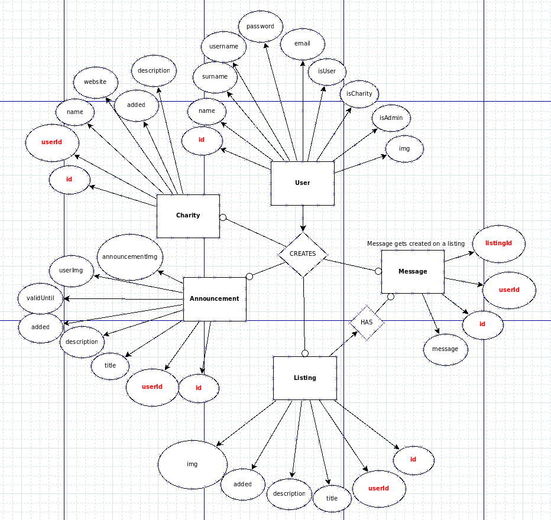

# Karma / Charie
Unified charity app

Vilnius University, Faculty of Mathematics and Informatics, Software Engineering, 3rd semester, Software Engineering I

Made with C# and Blazor

# Maintainers
* [Vilius Puškunalis](https://github.com/Puskunalis)
* [Justas Gasparaitis](https://github.com/JustasGasparaitis)
* [Redas Serafimavičius](https://github.com/redasSer)
* [Martynas Strazdas](https://github.com/MartynasStrazdas)

# Local development
Built with Visual Studio 2019 Community. Copy the `.env.sample` file to `.env` and change the variables:

* `EMAIL_PASSWORD`: Charie email password
* `DB_CONNECTION_STRING`: SQL Server (Azure SQL) connection string

# Coding conventions
- [C# conventions by Microsoft](https://docs.microsoft.com/en-us/dotnet/csharp/fundamentals/coding-style/coding-conventions)
   - [dotnet-format](https://github.com/dotnet/format)
- [HTML/CSS guidelines by Google](https://google.github.io/styleguide/htmlcssguide.html)

# ER Diagram
